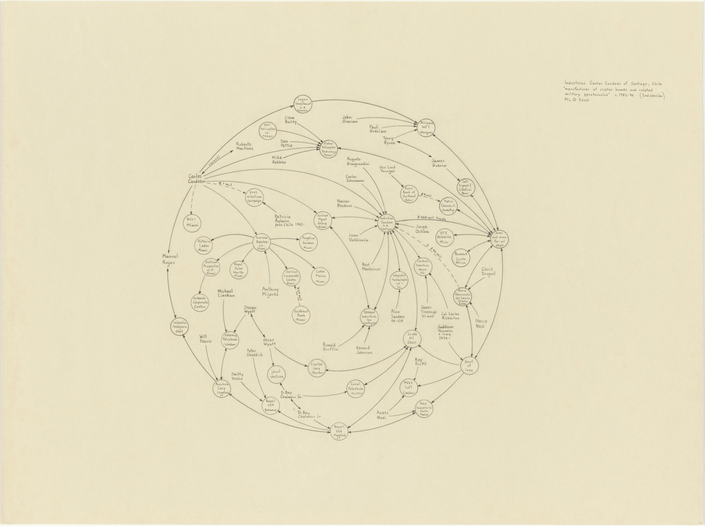
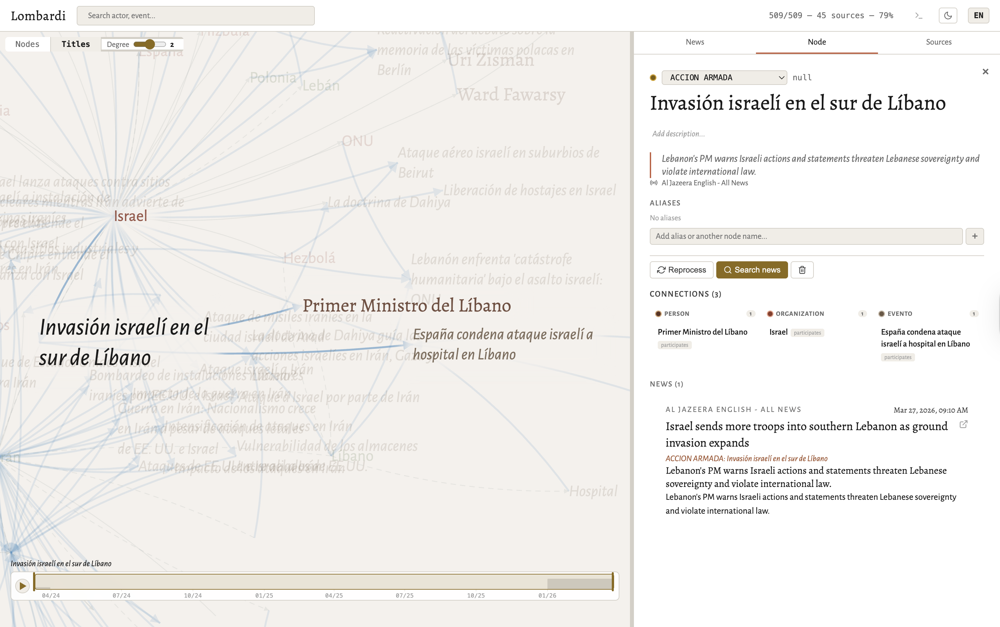

# Lombardi

Es un visualizador de noticias especial, inspirado y en homenaje a [Mark Lombardi](https://en.wikipedia.org/wiki/Mark_Lombardi) (1951–2000), artista que dedicó su vida a dibujar a mano las redes ocultas del poder: bancos, políticos, traficantes de armas y sus conexiones invisibles. Sus dibujos son grafos de conspiración — mapas de relaciones que el periodismo convencional no podía (o no quería) articular.



*Mark Lombardi — Carlos Cardoen, Industrias Cardoen, Chile, 1982–94 (séptima versión), 1999. Grafito sobre papel. MoMA, Nueva York.*

**Lombardi** automatiza lo que Mark hacía a mano: trazar las líneas entre actores, eventos y contradicciones a partir del flujo noticioso mundial, usando inteligencia artificial local para que la soberanía sobre los datos permanezca en manos del investigador.



## Funcionalidades

### 🔥 Sistema de Controversias (Core)
- **Detección automática de contradicciones** — LLMs locales comparan eventos de distintas fuentes
- **Visualización de tensiones** — Aristas `CONTRADICE` con tension_score, análisis y tipo
- **Modo disputa** — Vista dedicada del subgrafo de eventos contradictorios
- **Roadmap colaborativo** — [Verificación ciudadana, votación ponderada, evidencias múltiples →](docs/controversias.md)

### 📰 Ingesta y Procesamiento
- **Feeds RSS configurables** — Toggle on/off por fuente, temas de interés personalizables
- **Extracción ontológica** — LLMs locales (Ollama) extraen actores, eventos y relaciones
- **Grafo de conocimiento** — Apache AGE (PostgreSQL + Cypher) como base

### 🌐 Visualización
- **Vista panorama** — Landing con eventos recientes y timeline brushable con play
- **Visualización egocéntrica** — Grafo navegable con foco dinámico y grados de separación
- **Dos modos de renderizado** — Nodos circulares o tipográficos (collision de bounding box)

### ✏️ Edición y Enriquecimiento
- **Edición de nodos** — Tipos, aliases, merge, descripción, eliminación
- **Gestión de relaciones** — Crear aristas manualmente con metadatos
- **Enriquecimiento** — Wikidata + Claude API (on-demand, streaming)
- **Normalización** — Sistema de aliases para evitar duplicados

### 🛠️ UX
- **i18n** — Español / English con detección automática
- **Tema claro/oscuro**
- **Breadcrumbs semánticos** — Rastro de navegación entre nodos

## Stack

| Capa | Tecnología | Rol |
|:---|:---|:---|
| Base de datos | Apache AGE (Docker) | Grafo + SQL híbrido |
| IA local | Ollama (nativo M3) | Extracción ontológica batch |
| IA on-demand | Claude API | Procesamiento rápido interactivo |
| Backend | Node.js vanilla | API REST + daemon de ingesta |
| Frontend | Vanilla JS + D3.js | Grafo egocéntrico, sin frameworks |

## Quick Start

```bash
cat docs/local-deploy.md        # Instrucciones completas

# Resumen rápido:
docker compose up -d             # Levanta Apache AGE
npm install                      # Dependencias
./start.sh                       # O manualmente:
node backend/api.js              # http://localhost:3000
```

## Arquitectura

```
[RSS Feeds] --> rss_fetcher.js --> /data/raw_news/*.json
                                        |
                                   ingest.js + Ollama
                                        |
                                  .extraction.json (cache)
                                        |
                                   Apache AGE (grafo)
                                        |
                                     api.js
                                        |
                                   frontend (D3.js)
```

## Estructura

```
/lombardi
├── backend/
│   ├── api.js              # Servidor HTTP + API REST
│   ├── ingest.js           # Daemon: Ollama → grafo
│   ├── rss_fetcher.js      # Descarga RSS a JSON
│   ├── extractor.js        # Prompt de extracción ontológica
│   ├── resolver.js         # Detector de contradicciones
│   └── seed.js             # Grafo de conocimiento base
├── frontend/
│   ├── index.html          # UI principal
│   ├── app.js              # Motor D3.js egocéntrico + panorama
│   ├── timeline.js         # Timeline brushable con play/animate
│   ├── i18n.js             # ES/EN
│   └── css/                # variables, layout, graph, detail
├── data/
│   ├── schema.json         # Ontología (fuente de verdad)
│   ├── aliases.json        # Normalización de entidades
│   ├── seed-knowledge.json # Grafo base
│   ├── sources/feeds.json   # Feeds RSS configurables
│   ├── sources/topics.json  # Temas de interés
│   └── raw_news/           # Noticias crudas + extracciones
├── docs/
│   └── local-deploy.md
├── docker-compose.yml
├── backlog.md
└── package.json
```

## Ontología

Definida en [`data/schema.json`](data/schema.json):

**Nodos:** Actor (Person, Organization, Location, Object), Evento
**Aristas:** PARTICIPA, CAUSA, CONTRADICE, COMPLEMENTA, DESMIENTE, ACTUALIZA, UBICADO_EN, PERTENECE_A
**17 tipos de evento:** desde CAMBIO_LIDERAZGO hasta EVENTO_GENERICO

## Interfaz

- **Panorama:** Landing con eventos recientes, actores compartidos como puentes, timeline con play
- **Vista Nodes:** Grafo de fuerza con colores por tipo
- **Vista Titles:** Tipografía serif como nodos, collision de bounding box
- **Panel de detalle:** Tipo editable, descripción, aliases, merge, relaciones, noticias vinculadas, Wikidata
- **Panel de fuentes:** Gestión de feeds RSS y temas de interés
- **Breadcrumbs semánticos:** Aristas entre nodos navegados
- **Buscador:** Autocompletado con dot de color
- **i18n:** ES/EN con browser detect
- **Tema claro/oscuro**

## Documentación

- [`docs/controversias.md`](docs/controversias.md) — **Sistema de Controversias** (visión, roadmap, arquitectura colaborativa)
- [`docs/modelo-de-datos.md`](docs/modelo-de-datos.md) — Modelo de datos completo (diagramas Mermaid, ontología, relaciones)
- [`docs/local-deploy.md`](docs/local-deploy.md) — Instalación local
- [`backlog.md`](backlog.md) — Roadmap general del proyecto
- [`data/schema.json`](data/schema.json) — Ontología auditable (fuente de verdad)
- [`spec/controversy-model.allium`](spec/controversy-model.allium) — Especificación formal Allium v3

## Licencia

ISC
