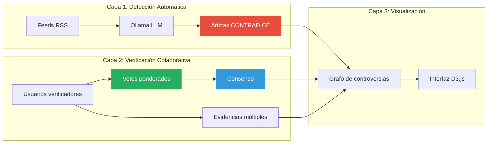
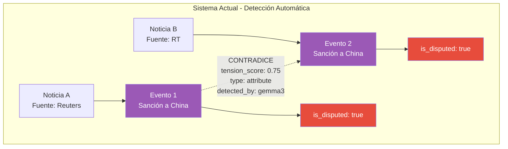
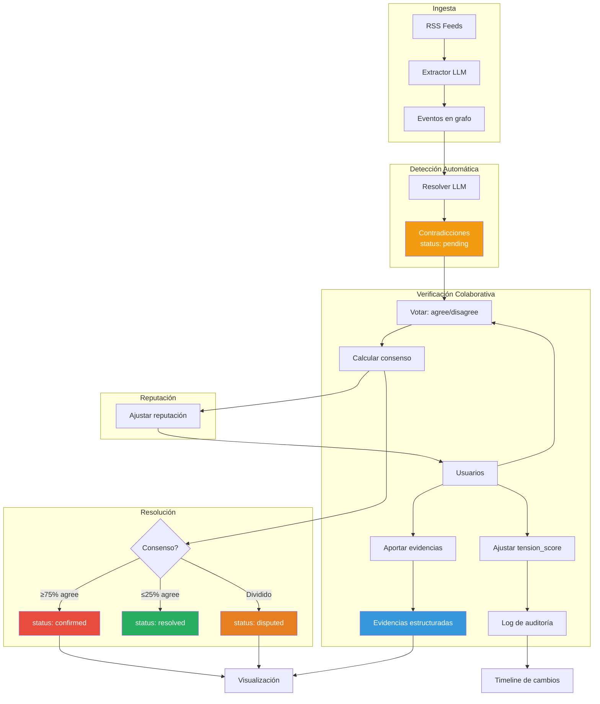
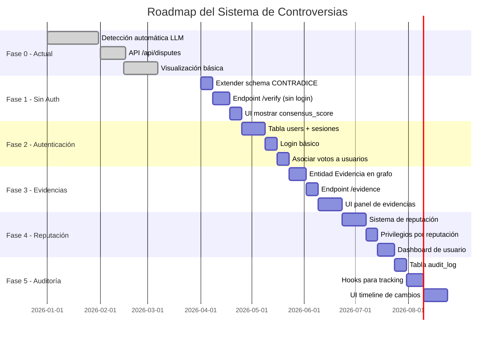
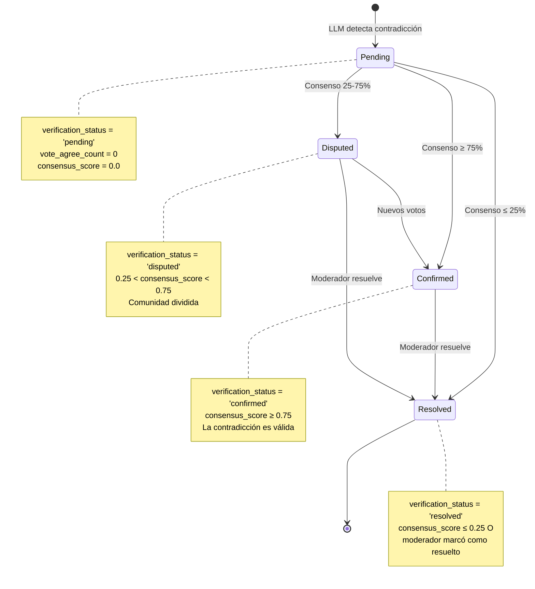
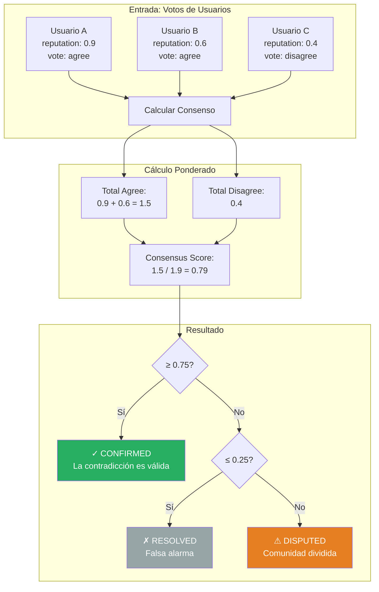
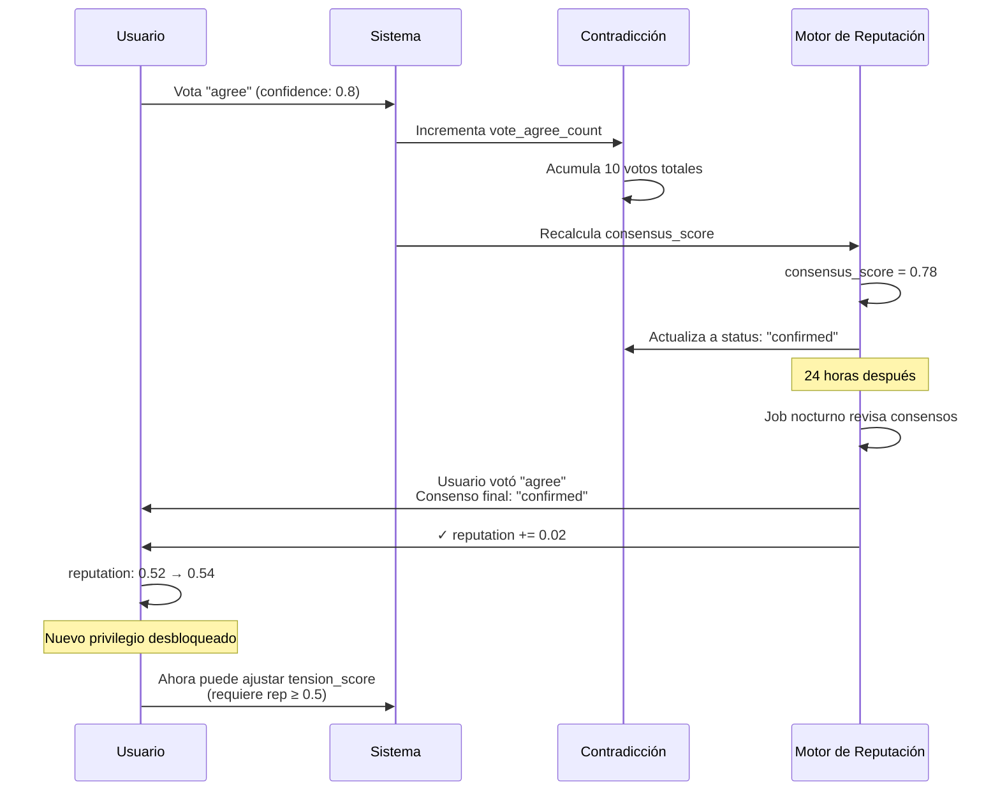
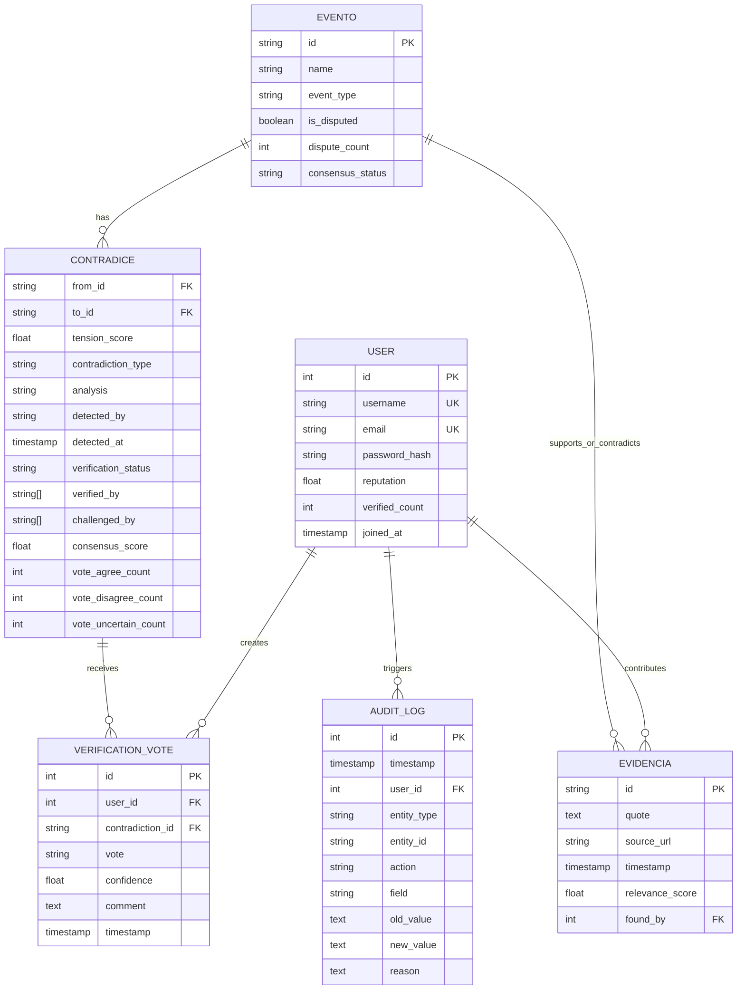

# Sistema de Controversias de Lombardi

**Versión:** 1.0.0 (Roadmap)
**Última actualización:** 2026-03-30

---

## Índice

1. [Visión General](#visión-general)
2. [Estado Actual](#estado-actual)
3. [Arquitectura Objetivo](#arquitectura-objetivo)
4. [Roadmap de Implementación](#roadmap-de-implementación)
5. [Especificación Técnica](#especificación-técnica)
6. [Referencias](#referencias)

---

## Visión General

El **Sistema de Controversias** es el corazón diferenciador de Lombardi. Mientras que la mayoría de agregadores de noticias presentan información sin contexto crítico, Lombardi **detecta, visualiza y permite verificar colaborativamente las contradicciones** entre fuentes noticiosas.

### El Problema

En el ecosistema noticioso actual:
- Múltiples fuentes reportan el "mismo" evento con narrativas contradictorias
- Los lectores no tienen herramientas para comparar versiones conflictivas
- Las contradicciones quedan ocultas en el flujo de información
- No existe un mecanismo colaborativo para verificar y resolver discrepancias

### Por Qué Importa: Resistencia y Soberanía Informacional

El sistema de controversias de Lombardi no es solo una característica técnica — **es un acto político de resistencia contra la fragmentación algorítmica**.

#### Leer juntos, no divididos

Las redes sociales de la última década nos **dividieron**. Cada usuario recibe un feed personalizado por algoritmos opacos que maximizan engagement, no entendimiento. Leemos las noticias aislados en nuestras burbujas, sin saber qué ven los demás, sin poder contrastar versiones, sin lenguaje común para deliberar.

Lombardi propone lo opuesto: **un registro público común** (*public record*) donde todos vemos el mismo grafo de eventos, las mismas contradicciones, las mismas evidencias. No hay algoritmo curatorial que decida qué controversia es "relevante para ti". El grafo es el mismo para todos.

#### La anotación colectiva como acto cívico

Cuando **votamos sobre una contradicción**, cuando **aportamos una evidencia**, cuando **deliberamos en los comentarios**, no estamos simplemente "interactuando con contenido". Estamos ejerciendo **ciudadanía informacional**:

- **Verificamos colectivamente** qué fuentes son confiables
- **Construimos consenso** sobre qué contradicciones son reales
- **Dejamos rastro auditable** de nuestro razonamiento para futuros lectores
- **Nos conectamos como comunidad epistémica**, no como consumidores atomizados

El sistema de reputación no es gamificación vacía — es el reconocimiento de que **la verificación de hechos es trabajo colectivo** que requiere expertise distribuida. Un usuario con reputación alta no es un "influencer", es alguien cuya deliberación ha demostrado ser rigurosa.

#### Soberanía sobre el conocimiento

Al usar **IA local** (Ollama) en lugar de APIs propietarias, al **controlar nuestros propios datos** en lugar de depender de plataformas, al **transparentar los algoritmos de detección** en lugar de ocultarlos, Lombardi afirma: **el conocimiento colectivo debe ser un bien común**, no un activo corporativo.

Cada verificación, cada voto, cada evidencia aportada **enriquece un grafo que nos pertenece a todos**. No estamos generando valor para una plataforma que luego nos lo revende segmentado. Estamos construyendo infraestructura informacional pública.

#### En sentido opuesto a las redes sociales

| Lógica de redes sociales | Lógica de Lombardi |
|---------------------------|---------------------|
| Feed personalizado | Grafo común |
| Algoritmo opaco | Ontología auditable |
| Maximizar engagement | Maximizar comprensión |
| Usuarios divididos por burbujas | Ciudadanos conectados por deliberación |
| Contenido como mercancía | Conocimiento como bien común |
| Verificación centralizada (fact-checkers corporativos) | Verificación distribuida (consenso comunitario) |
| Plataforma rentabiliza tu atención | Herramienta para tu soberanía |

#### Un acto de resistencia

En un mundo donde:
- Los medios tradicionales han perdido credibilidad
- Las plataformas algorítmicas fragmentan la realidad
- La desinformación se propaga más rápido que la verdad
- La deliberación pública ha colapsado

**Construir un sistema de controversias colaborativo es resistir**. Es afirmar que todavía podemos, como ciudadanos, **ponernos de acuerdo sobre qué pasó**, incluso cuando las fuentes discrepan. Es reclamar la capacidad de **deliberar juntos** sobre la realidad compartida.

Lombardi no reemplaza el periodismo — lo complementa con **una capa de verificación ciudadana**. No elimina las contradicciones — las **hace visibles y deliberables**. No promete una verdad única — construye **consensos auditables**.

### Nuestra Solución



**Lombardi combina**:
1. **IA local** para detección automática de contradicciones
2. **Verificación colaborativa** para validar/desafiar lo detectado
3. **Visualización de grafo** para explorar relaciones entre eventos disputados

---

## Estado Actual

### ✅ Lo que tenemos (implementado)



#### 1. Detección Automática de Contradicciones

**Archivo**: `backend/resolver.js`

**Flujo**:
1. El sistema busca pares de eventos del mismo tema desde fuentes diferentes
2. Envía ambas versiones a Ollama LLM (Gemma3/Qwen3.5)
3. El LLM responde con JSON estructurado:
   ```json
   {
     "relation": "CONTRADICE",
     "contradiction_type": "attribute",
     "tension_score": 0.75,
     "analysis": "Reuters reporta 25% de aranceles, RT reporta 15%",
     "claim_a_bias": "pro-occidental",
     "claim_b_bias": "pro-ruso"
   }
   ```
4. Se crea una arista `CONTRADICE` en el grafo con estos metadatos

**Tipos de contradicción detectados**:
- **fact**: Una fuente dice que X ocurrió, otra que no
- **actor**: Discrepan sobre QUIÉN lo hizo
- **attribute**: Discrepan en cantidades, fechas o detalles
- **narrative**: Mismos hechos, encuadres opuestos

#### 2. Propiedades en el Grafo

**Nodo `Evento`**:
```javascript
{
  id: "sancion-china-2026",
  name: "EE.UU. impone sanciones a China",
  event_type: "SANCION_ECONOMICA",
  date: "2026-03-15",
  is_disputed: true,        // ✅ Implementado
  evidence_quote: "...",
  source: "Reuters",
  source_url: "https://...",
  extraction_confidence: 0.92
}
```

**Arista `CONTRADICE`**:
```javascript
{
  from: "evento-reuters",
  to: "evento-rt",
  tension_score: 0.75,           // ✅ Implementado
  contradiction_type: "attribute", // ✅ Implementado
  analysis: "Discrepan en cifras", // ✅ Implementado
  detected_by: "gemma3:latest",    // ✅ Implementado
  detected_at: "2026-03-30T10:00:00Z" // ✅ Implementado
}
```

#### 3. API REST

| Endpoint | Método | Estado | Descripción |
|----------|--------|--------|-------------|
| `/api/disputes` | GET | ✅ Implementado | Retorna subgrafo de eventos disputados + aristas de controversia |
| `/api/edge/create` | POST | ✅ Implementado | Crear arista manualmente (incluye tension_score) |
| `/api/node/update` | POST | ⚠️ Parcial | Actualizar propiedades del nodo (pero NO is_disputed) |

#### 4. Frontend - Visualización

**Modo Disputa** (`frontend/app.js`):
- Toggle "Dispute Mode" en toolbar
- Fetcha `/api/disputes` y renderiza subgrafo
- Nodos disputados con:
  - Color rojo/naranja (#C45D3E)
  - Halo animado
  - Badge "Disputado"
- Aristas `CONTRADICE` con color rojo (#E74C3C) y grosor 5

**Limitaciones actuales**:
- ❌ No muestra `tension_score` en la UI
- ❌ No muestra `contradiction_type` o `analysis`
- ❌ No permite votar/verificar
- ❌ Solo visualización, sin interacción colaborativa

---

## Arquitectura Objetivo

### 🎯 Lo que queremos construir (visión completa)



### Nuevas Entidades

#### 1. Usuario

```javascript
{
  id: "user-001",
  name: "Ana García",
  email: "ana@example.com",
  reputation: 0.72,                    // 0.0-1.0, basado en historial
  expertise_areas: ["ACCION_ARMADA", "RUPTURA_DIPLOMATICA"],
  verified_count: 47,
  joined_at: "2026-01-15T00:00:00Z"
}
```

**Sistema de reputación**:
- Comienzan con `reputation: 0.5`
- **Suben +0.02** si votan de acuerdo con el consenso final
- **Bajan -0.01** si votan en contra del consenso
- Reputación determina privilegios:
  - ≥0.3: puede votar
  - ≥0.5: puede ajustar tension_score
  - ≥0.6: puede resolver contradicciones (moderador)

#### 2. Evidencia

```javascript
{
  id: "evid-001",
  quote: "El presidente anunció aranceles del 25%",
  source_url: "https://reuters.com/article#paragraph-5",
  timestamp: "2026-03-30T11:00:00Z",
  relevance_score: 0.9,
  found_by: "user-001"
}

// Relación RESPALDA:
{
  from: "evid-001",
  to: "evento-reuters",
  supports_or_contradicts: "supports",
  confidence: 0.9
}
```

**Beneficios**:
- Múltiples evidencias por evento (no solo una cita)
- URL con fragmento para ubicar exactamente la cita
- Trazabilidad de quién aportó la evidencia

#### 3. VerificationVote

```javascript
{
  id: "vote-001",
  user: "user-001",
  contradiction: "contradice-001",
  vote: "agree",                    // agree | disagree | uncertain
  confidence: 0.8,                  // 0.0-1.0
  comment: "Las cifras claramente difieren",
  timestamp: "2026-03-30T12:00:00Z"
}
```

#### 4. AuditLog

```javascript
{
  id: "audit-001",
  timestamp: "2026-03-30T12:00:00Z",
  user: "user-001",
  entity_type: "Contradice",
  entity_id: "contradice-001",
  action: "VERIFY",
  field: "vote",
  old_value: null,
  new_value: "agree",
  reason: "Verificación manual de contradicción"
}
```

### Propiedades Extendidas

**Arista `CONTRADICE` (extendida)**:
```javascript
{
  // ✅ Propiedades actuales (ya implementadas)
  tension_score: 0.75,
  contradiction_type: "attribute",
  analysis: "...",
  detected_by: "gemma3:latest",
  detected_at: "2026-03-30T10:00:00Z",

  // 🎯 Propiedades nuevas (por implementar)
  verification_status: "confirmed",  // pending | confirmed | disputed | resolved
  verified_by: ["user-001", "user-005"],
  challenged_by: ["user-012"],
  consensus_score: 0.78,             // 0.0-1.0, ponderado por reputación
  vote_agree_count: 8,
  vote_disagree_count: 2,
  vote_uncertain_count: 1
}
```

**Nodo `Evento` (extendido)**:
```javascript
{
  // ✅ Propiedades actuales
  id: "...",
  name: "...",
  is_disputed: true,

  // 🎯 Propiedades nuevas (derivadas)
  dispute_count: 3,                  // número de contradicciones activas
  consensus_status: "contested"      // uncontroversial | emerging | contested | hotly_disputed | resolved
}
```

### Nuevos Endpoints API

| Endpoint | Método | Función |
|----------|--------|---------|
| `POST /api/disputes/:id/verify` | POST | Usuario vota sobre una contradicción |
| `POST /api/events/:id/evidence` | POST | Usuario aporta evidencia a un evento |
| `PATCH /api/disputes/:id/tension` | PATCH | Usuario ajusta tension_score (requiere reputación ≥0.5) |
| `POST /api/disputes/:id/resolve` | POST | Moderador marca contradicción como resuelta |
| `GET /api/audit` | GET | Obtener log de auditoría (filtrable por entidad/usuario/fecha) |
| `GET /api/users/:id/reputation` | GET | Ver historial de reputación de un usuario |

### Nueva UI - Componentes

#### Panel de Verificación

```
┌─────────────────────────────────────────────────────────┐
│  Contradicción: Reuters vs RT                           │
│  Tipo: attribute | Detectado: 30/03/2026 10:00         │
├─────────────────────────────────────────────────────────┤
│  Tensión actual: ████████░░ 0.75                        │
│                                                          │
│  Reuters dice: "Aranceles del 25%"                      │
│  RT dice: "Aranceles del 15%"                           │
│                                                          │
│  Análisis LLM: Las fuentes discrepan en la cifra...    │
├─────────────────────────────────────────────────────────┤
│  ¿Es válida esta contradicción?                         │
│  ○ Sí, confirmo    ○ No, falsa alarma    ○ No estoy seguro │
│                                                          │
│  Tu confianza: ████████░░ 0.8                           │
│                                                          │
│  Comentario (opcional):                                 │
│  ┌───────────────────────────────────────────────────┐ │
│  │ Las cifras claramente difieren...                 │ │
│  └───────────────────────────────────────────────────┘ │
│                                                          │
│  [Enviar verificación]                                  │
├─────────────────────────────────────────────────────────┤
│  Consenso comunitario: 78% confirman (8 a favor, 2 en contra) │
│  Estado: ✓ Confirmado                                   │
└─────────────────────────────────────────────────────────┘
```

#### Panel de Evidencias

```
┌─────────────────────────────────────────────────────────┐
│  Evidencias para: "Sanción a China"                     │
├─────────────────────────────────────────────────────────┤
│  📄 Reuters (2026-03-15)                                │
│  "El presidente anunció aranceles del 25%..."          │
│  ⭐ Relevancia: 0.9 | Aportado por: Ana García         │
│  [Ver fuente completa →]                                │
├─────────────────────────────────────────────────────────┤
│  📄 Bloomberg (2026-03-15)                              │
│  "La Casa Blanca confirmó tarifas del 25% a..."        │
│  ⭐ Relevancia: 0.95 | Aportado por: Sistema           │
│  [Ver fuente completa →]                                │
├─────────────────────────────────────────────────────────┤
│  📄 RT (2026-03-15)                                     │
│  "Se anunciaron aranceles del 15% según..."            │
│  ⭐ Relevancia: 0.8 | Aportado por: Sistema            │
│  ⚠️ Contradice otras fuentes                            │
│  [Ver fuente completa →]                                │
├─────────────────────────────────────────────────────────┤
│  [+ Agregar nueva evidencia]                            │
└─────────────────────────────────────────────────────────┘
```

#### Timeline de Auditoría

```
┌─────────────────────────────────────────────────────────┐
│  Historial de "Contradicción Reuters vs RT"            │
├─────────────────────────────────────────────────────────┤
│  30/03/2026 12:30 - Ana García                          │
│  ✓ Verificó la contradicción (confianza: 0.8)          │
│  "Las cifras claramente difieren"                       │
├─────────────────────────────────────────────────────────┤
│  30/03/2026 11:45 - Carlos Ruiz                         │
│  ✗ Desafió la contradicción (confianza: 0.6)           │
│  "Podría ser error de transcripción"                    │
├─────────────────────────────────────────────────────────┤
│  30/03/2026 10:00 - Sistema (gemma3)                    │
│  🤖 Detectó contradicción automáticamente               │
│  tension_score: 0.75 | type: attribute                 │
└─────────────────────────────────────────────────────────┘
```

---

## Roadmap de Implementación

### 📋 Fases de desarrollo



---

### Fase 0: Estado Actual ✅ (Completado)

**Objetivo**: Detección automática de contradicciones

**Funcionalidades**:
- ✅ Resolver LLM detecta contradicciones entre eventos de fuentes diferentes
- ✅ Aristas `CONTRADICE` con `tension_score`, `contradiction_type`, `analysis`
- ✅ Propiedad `is_disputed` en eventos
- ✅ Endpoint `/api/disputes` para obtener subgrafo
- ✅ Visualización básica en modo disputa (nodos rojos, halo)

**Archivos clave**:
- `backend/resolver.js`
- `backend/api.js` (líneas 87-164)
- `frontend/app.js` (dispute mode)

---

### Fase 1: Verificación Básica (Sin Autenticación) 🎯

**Objetivo**: Permitir que usuarios anónimos verifiquen contradicciones

**Duración estimada**: 3-4 semanas

#### Tareas

**1.1. Extender schema de `CONTRADICE`** (7 días)
- [ ] Agregar propiedades a aristas en AGE:
  ```cypher
  {
    verification_status: 'pending',
    consensus_score: 0.0,
    vote_agree_count: 0,
    vote_disagree_count: 0,
    vote_uncertain_count: 0
  }
  ```
- [ ] Script de migración para aristas existentes
- [ ] Actualizar `data/schema.json`

**1.2. Crear endpoint `/api/disputes/:id/verify`** (10 días)
- [ ] Recibir parámetros:
  ```javascript
  {
    verifier: "nombre_anonimo",  // string simple
    vote: "agree|disagree|uncertain",
    confidence: 0.8,
    comment: "texto opcional"
  }
  ```
- [ ] Actualizar contadores de votos en la arista
- [ ] Calcular `consensus_score` simple (sin reputación aún):
  ```javascript
  consensus_score = agree_count / (agree_count + disagree_count)
  ```
- [ ] Actualizar `verification_status`:
  - `confirmed` si consensus ≥ 0.75
  - `resolved` si consensus ≤ 0.25
  - `disputed` si entre 0.25-0.75
- [ ] Tests unitarios

**1.3. UI para mostrar consenso** (7 días)
- [ ] En panel de detalle de arista, mostrar:
  - Barra de consenso visual
  - Contadores de votos (X a favor, Y en contra)
  - Estado de verificación con badge
- [ ] Botones "Confirmar" / "Desafiar" / "No estoy seguro"
- [ ] Slider de confianza (0-100%)
- [ ] Campo de comentario opcional

**Entregables**:
- Usuarios pueden votar sobre contradicciones sin login
- Sistema muestra consenso comunitario
- Estados de verificación visibles en la UI

---

### Fase 2: Autenticación y Usuarios 🎯

**Objetivo**: Sistema de usuarios con tracking de identidad

**Duración estimada**: 4 semanas

#### Tareas

**2.1. Modelo de datos** (14 días)
- [ ] Crear tabla `users` en PostgreSQL:
  ```sql
  CREATE TABLE users (
      id SERIAL PRIMARY KEY,
      username VARCHAR(50) UNIQUE NOT NULL,
      email VARCHAR(255) UNIQUE NOT NULL,
      password_hash VARCHAR(255) NOT NULL,
      reputation FLOAT DEFAULT 0.5,
      verified_count INT DEFAULT 0,
      joined_at TIMESTAMPTZ DEFAULT NOW()
  );
  ```
- [ ] Crear tabla `verification_votes`:
  ```sql
  CREATE TABLE verification_votes (
      id SERIAL PRIMARY KEY,
      user_id INT REFERENCES users(id),
      contradiction_id VARCHAR(255),
      vote VARCHAR(20),
      confidence FLOAT,
      comment TEXT,
      timestamp TIMESTAMPTZ DEFAULT NOW(),
      UNIQUE(user_id, contradiction_id)
  );
  ```
- [ ] Agregar nodos `Usuario` en AGE (opcional, o solo SQL)

**2.2. Sistema de autenticación** (7 días)
- [ ] Login/registro básico con bcrypt
- [ ] Sesiones con express-session + cookies
- [ ] Middleware de autenticación para endpoints protegidos
- [ ] No requiere OAuth, email/password es suficiente

**2.3. Integrar autenticación con verificaciones** (7 días)
- [ ] Endpoint `/api/disputes/:id/verify` ahora requiere login
- [ ] Guardar votos en `verification_votes` con `user_id`
- [ ] Agregar campos `verified_by`, `challenged_by` a aristas:
  ```javascript
  verified_by: ['user-001', 'user-005'],
  challenged_by: ['user-012']
  ```
- [ ] Actualizar UI para mostrar "Verificado por: Ana, Carlos, María"

**Entregables**:
- Sistema de login/registro funcional
- Votos asociados a usuarios reales
- Panel de perfil básico (username, reputación, verificaciones realizadas)

---

### Fase 3: Evidencias Múltiples 🎯

**Objetivo**: Más allá de una cita por evento

**Duración estimada**: 4-5 semanas

#### Tareas

**3.1. Modelo de evidencias** (10 días)
- [ ] Crear nodos `Evidencia` en AGE:
  ```javascript
  {
    id: "evid-001",
    quote: "texto",
    source_url: "URL",
    timestamp: "ISO",
    relevance_score: 0.9,
    found_by: "user-001"
  }
  ```
- [ ] Crear aristas `RESPALDA`:
  ```javascript
  {
    from: "evid-001",
    to: "evento-001",
    supports_or_contradicts: "supports|contradicts|neutral",
    confidence: 0.9
  }
  ```
- [ ] Migrar `evidence_quote` actual a primera evidencia

**3.2. Endpoint `/api/events/:id/evidence`** (7 días)
- [ ] POST para agregar nueva evidencia:
  ```javascript
  {
    quote: "texto",
    source_url: "URL",
    position: "supports|contradicts",
    relevance: 0.8
  }
  ```
- [ ] GET para listar evidencias de un evento
- [ ] Validaciones (URL válida, quote no vacío)
- [ ] Requiere autenticación

**3.3. UI panel de evidencias** (14 días)
- [ ] Tab "Evidencias" en panel de detalle
- [ ] Lista de evidencias con:
  - Quote completo
  - Link a fuente
  - Relevancia visual (estrellas)
  - Autor ("Aportado por: X")
  - Badge si contradice otras evidencias
- [ ] Formulario "+ Agregar evidencia"
- [ ] Validación de duplicados (misma URL)

**Entregables**:
- Múltiples evidencias por evento
- Usuarios pueden aportar fuentes adicionales
- Visualización clara de evidencias contradictorias

---

### Fase 4: Sistema de Reputación 🎯

**Objetivo**: Ponderar votos según expertise del usuario

**Duración estimada**: 4 semanas

#### Tareas

**4.1. Motor de reputación** (14 días)
- [ ] Función `compute_weighted_consensus()`:
  ```javascript
  // Ponderar votos por reputación
  total_agree = verified_by.map(u => u.reputation).sum()
  total_disagree = challenged_by.map(u => u.reputation).sum()
  consensus_score = total_agree / (total_agree + total_disagree)
  ```
- [ ] Regla de ajuste post-consenso:
  - Si usuario votó con el consenso: `reputation += 0.02`
  - Si votó contra: `reputation -= 0.01`
  - Cap en [0.0, 1.0]
- [ ] Job batch nocturno para recalcular reputaciones

**4.2. Privilegios por reputación** (7 días)
- [ ] Middleware de permisos:
  - `canVote(user)`: reputation ≥ 0.3
  - `canAdjustTension(user)`: reputation ≥ 0.5
  - `canResolve(user)`: reputation ≥ 0.6
- [ ] Endpoint `PATCH /api/disputes/:id/tension` (solo ≥0.5)
- [ ] Endpoint `POST /api/disputes/:id/resolve` (solo ≥0.6)
- [ ] Mensajes de error claros si no tiene permisos

**4.3. Dashboard de usuario** (10 días)
- [ ] Página `/profile/:username` con:
  - Reputación actual (gráfico de línea temporal)
  - Áreas de expertise (tags)
  - Verificaciones realizadas (lista)
  - Tasa de acierto (% votos con consenso)
- [ ] Badges de logros:
  - "Verificador confiable" (reputation ≥ 0.8)
  - "Moderador" (reputation ≥ 0.6)
  - "Experto en [tema]" (10+ verificaciones en un event_type)

**Entregables**:
- Consenso ponderado por expertise
- Sistema de privilegios escalonado
- Gamificación para incentivar buenas verificaciones

---

### Fase 5: Auditoría y Transparencia 🎯

**Objetivo**: Trazabilidad completa de cambios

**Duración estimada**: 4 semanas

#### Tareas

**5.1. Tabla de auditoría** (7 días)
- [ ] Crear tabla `audit_log`:
  ```sql
  CREATE TABLE audit_log (
      id SERIAL PRIMARY KEY,
      timestamp TIMESTAMPTZ DEFAULT NOW(),
      user_id INT REFERENCES users(id),
      entity_type VARCHAR(50),
      entity_id VARCHAR(255),
      action VARCHAR(20),
      field VARCHAR(100),
      old_value TEXT,
      new_value TEXT,
      reason TEXT
  );
  ```
- [ ] Índices en `entity_id`, `user_id`, `timestamp`

**5.2. Hooks de tracking** (10 días)
- [ ] Middleware global en `api.js` que captura:
  - Todas las mutaciones (POST, PATCH, DELETE)
  - Usuario que ejecuta
  - Valores antes/después
- [ ] Guardar en `audit_log` automáticamente
- [ ] No capturar GETs (solo mutaciones)

**5.3. UI timeline** (14 días)
- [ ] Componente "Historial" en panel de detalle
- [ ] Vista cronológica de cambios:
  ```
  30/03 12:30 - Ana García
  ✓ Verificó contradicción (0.8)
  "Las cifras claramente difieren"

  30/03 10:00 - Sistema
  🤖 Detectó contradicción
  ```
- [ ] Filtros: por usuario, por tipo de acción, por fecha
- [ ] Paginación (últimas 50 entradas)

**Entregables**:
- Log inmutable de todas las acciones
- Timeline visible para transparencia
- API `/api/audit?entity_id=X` para consultas

---

## Especificación Técnica

### Diagrama de Estados



### Diagrama de Consenso



### Diagrama de Flujo de Reputación



### Arquitectura de Datos



---

## Referencias

### Archivos clave

| Archivo | Descripción | Líneas relevantes |
|---------|-------------|-------------------|
| `spec/controversy-model.allium` | **Especificación formal Allium v3** | Todo el archivo |
| `backend/resolver.js` | Detección automática de contradicciones | Líneas 24-100 |
| `backend/api.js` | Endpoint `/api/disputes` | Líneas 87-164 |
| `backend/api.js` | Endpoint `/api/edge/create` | Búsqueda "edge/create" |
| `frontend/app.js` | Modo disputa en visualización | Búsqueda "dispute" |
| `data/schema.json` | Ontología actual | Líneas 72-88 (CONTRADICE) |

### Especificaciones relacionadas

- [`docs/modelo-de-datos.md`](./modelo-de-datos.md) — Modelo de datos completo de Lombardi
- [`spec/controversy-model.allium`](../spec/controversy-model.allium) — Especificación Allium del sistema de controversias

### Herramientas sugeridas

**Backend**:
- `express-session` — Manejo de sesiones
- `bcrypt` — Hash de contraseñas
- `express-validator` — Validación de inputs

**Frontend**:
- `d3-scale` — Escalas para visualizar consenso
- `d3-format` — Formateo de números (reputación, scores)

**Testing**:
- `jest` — Tests unitarios
- `supertest` — Tests de API

---

**Última actualización**: 2026-03-30
**Versión del documento**: 1.0.0
**Especificación Allium**: [`spec/controversy-model.allium`](../spec/controversy-model.allium)
