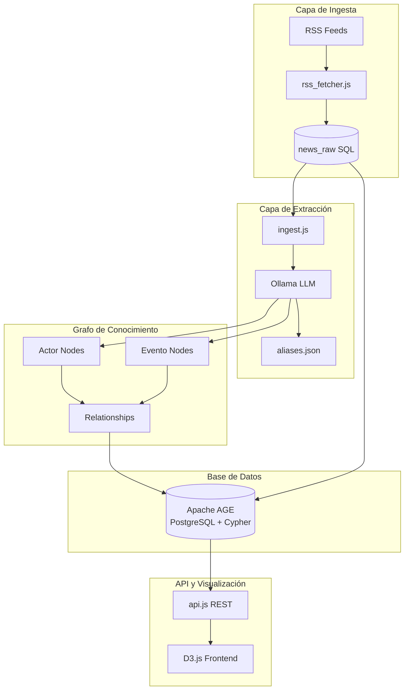
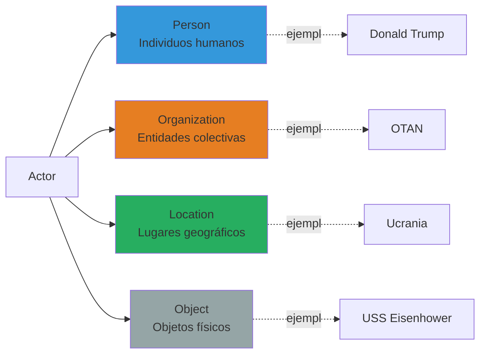
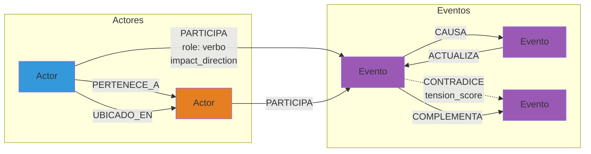
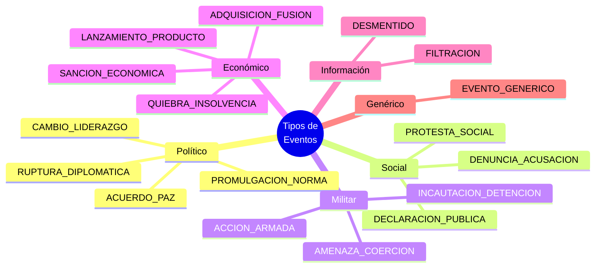
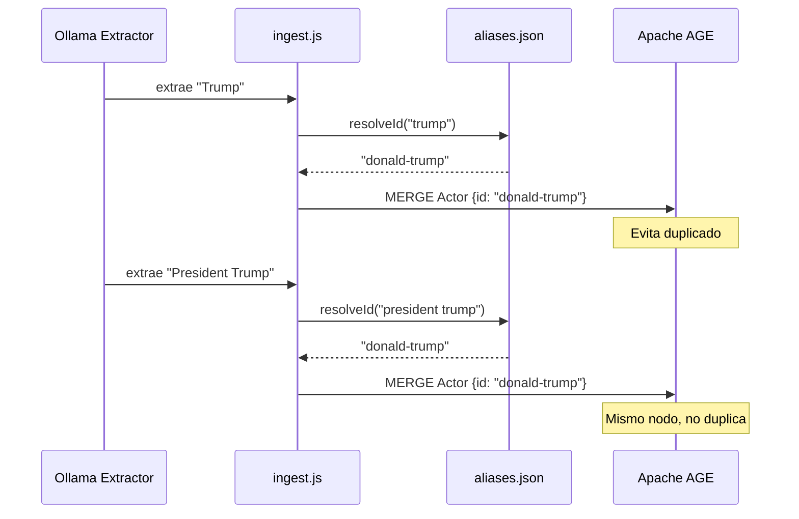
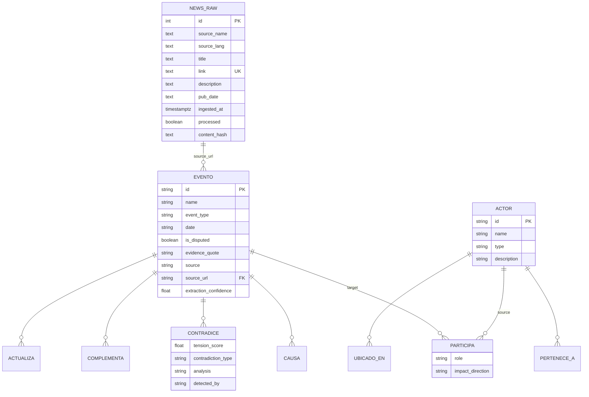
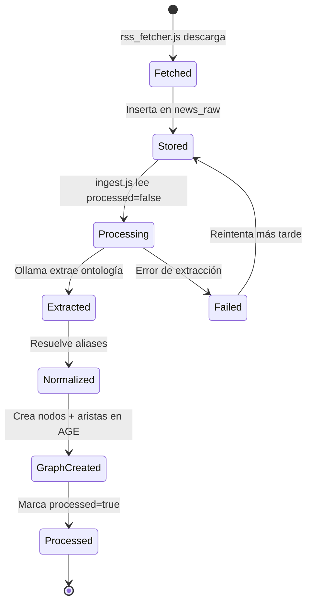
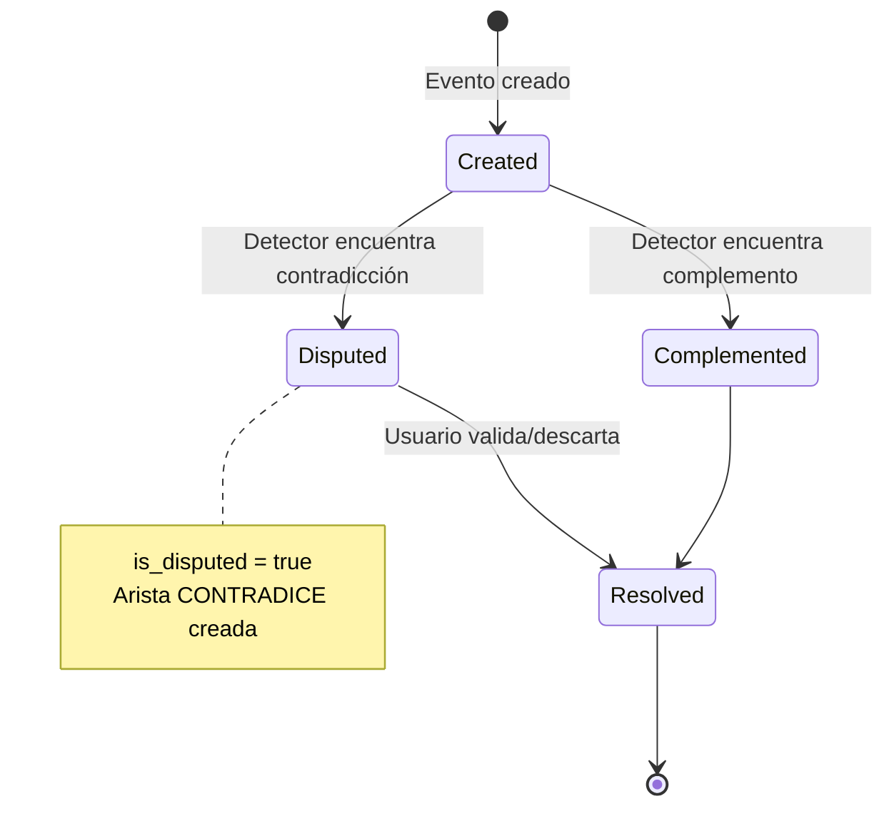
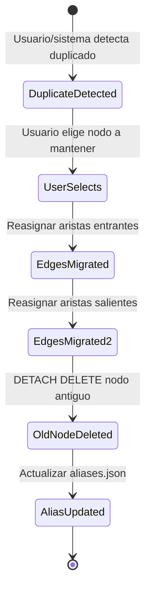
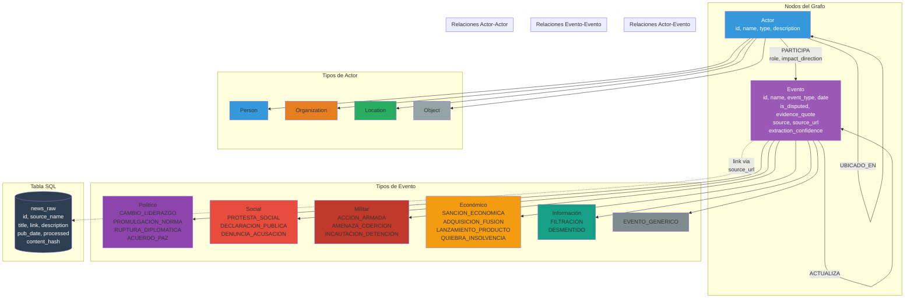

# Modelo de Datos de Lombardi

**Versión de la ontología:** 3.0.0
**Última actualización:** 2026-03-30

## Índice

1. [Introducción](#introducción)
2. [Arquitectura del Modelo](#arquitectura-del-modelo)
3. [Entidades (Nodos)](#entidades-nodos)
4. [Relaciones (Aristas)](#relaciones-aristas)
5. [Tipos de Eventos](#tipos-de-eventos)
6. [Sistema de Normalización (Aliases)](#sistema-de-normalización-aliases)
7. [Almacenamiento Híbrido](#almacenamiento-híbrido)
8. [Estados y Transiciones](#estados-y-transiciones)
9. [Reglas de Extracción](#reglas-de-extracción)
10. [Diagramas](#diagramas)

---

## Introducción

El modelo de datos de Lombardi está diseñado como un **grafo de conocimiento bipartito** que captura hechos noticiosos estructurados, extraídos de fuentes RSS mediante LLMs locales (Ollama). El diseño se inspira en los grafos conspiratorios de Mark Lombardi, donde cada conexión entre actores y eventos revela patrones subyacentes en el flujo noticioso global.

### Principios de diseño

1. **Ontología semántica clara**: Actor + Evento como centros gravitacionales
2. **Detección de contradicciones**: Múltiples fuentes → tensión entre narrativas
3. **Normalización de entidades**: Sistema de aliases para evitar duplicados
4. **Almacenamiento híbrido**: Grafo (AGE) para relaciones, SQL para noticias crudas
5. **Extracción controlada**: LLMs con prompts estructurados que fuerzan JSON válido

---

## Arquitectura del Modelo



---

## Entidades (Nodos)

El grafo contiene dos tipos principales de nodos:

### 1. Actor

**Descripción**: Entidad discreta que participa en eventos del mundo noticioso.

**Propiedades**:

| Propiedad | Tipo | Descripción |
|-----------|------|-------------|
| `id` | `string` | Identificador único en formato kebab-case (PK) |
| `name` | `string` | Nombre legible para visualización |
| `type` | `enum` | Clasificación: `Person`, `Organization`, `Location`, `Object` |
| `description` | `string` | Descriptor breve en español (cargo, rol, ubicación) |

**Clasificación de tipos**:



**Criterios de clasificación**:

- **Person**: Seres humanos individuales (políticos, ejecutivos, activistas). **NO** grupos.
- **Organization**: Empresas, gobiernos, partidos políticos, militares, ONGs, medios, organismos internacionales (ONU, OTAN, G7).
- **Location**: Países, ciudades, regiones, características geográficas (Estrecho de Ormuz, Mar Negro).
- **Object**: **SOLO** objetos físicos específicos o productos (un barco, un arma, una moneda, un documento). Usar con moderación.

**⚠️ Importante**: Conceptos abstractos (sanciones, estrategias, políticas) **NO** son actores, son el evento mismo.

### 2. Evento

**Descripción**: Hecho noticioso discreto. Es el centro gravitacional del grafo — los actores participan en eventos, no al revés.

**Propiedades**:

| Propiedad | Tipo | Descripción |
|-----------|------|-------------|
| `id` | `string` | Identificador descriptivo kebab-case (PK) |
| `name` | `string` | Nombre del evento en español |
| `event_type` | `enum` | Categoría del evento (ver [Tipos de Eventos](#tipos-de-eventos)) |
| `date` | `string` | Fecha del evento en formato `YYYY-MM-DD` (puede ser `null`) |
| `is_disputed` | `boolean` | `true` si hay versiones conflictivas del hecho |
| `evidence_quote` | `string` | Cita textual en idioma original de la fuente |
| `source` | `string` | Nombre de la fuente que reporta el evento |
| `source_url` | `string` | URL de la noticia original (enlace a `news_raw`) |
| `extraction_confidence` | `float` | Confianza del LLM en la extracción (0.0-1.0) |

**Ejemplo de evento**:

```json
{
  "id": "disculpa-rai-bobsled-israel",
  "name": "RAI se disculpa por gesto de atleta de bobsled hacia Israel",
  "event_type": "DECLARACION_PUBLICA",
  "date": "2026-02-15",
  "is_disputed": false,
  "evidence_quote": "RAI issued an official apology following...",
  "source": "BBC News",
  "source_url": "https://...",
  "extraction_confidence": 0.92
}
```

---

## Relaciones (Aristas)

Las aristas conectan nodos y definen el significado del grafo.

### Diagrama General de Relaciones



### 1. PARTICIPA (Actor → Evento)

**Descripción**: El actor tiene un rol en el evento.

**Propiedades**:

| Propiedad | Tipo | Valores | Descripción |
|-----------|------|---------|-------------|
| `role` | `string` | verbo español | Describe la participación: "se disculpa", "ataca", "sanciona", "declara" |
| `impact_direction` | `enum` | `positive`, `negative`, `neutral` | Dirección del impacto del actor en el evento |

**Estilo visual**: `color: #2980B9`, flecha, grosor 2, distancia de fuerza 80

**Ejemplo**:
```
(donald-trump)-[PARTICIPA {role: "impone", impact_direction: "negative"}]->(sancion-china-2026)
```

### 2. CAUSA (Evento → Evento)

**Descripción**: Un evento causa, desencadena o es la razón de otro evento.

**Propiedades**: Ninguna adicional

**Estilo visual**: `color: #8E44AD`, flecha, grosor 3, distancia 150

**Ejemplo**:
```
(invasion-rusia-ucrania)-[CAUSA]->(expulsion-diplomáticos-ue)
```

### 3. CONTRADICE (Evento → Evento)

**Descripción**: Dos eventos de distintas fuentes se contradicen sobre el mismo hecho.

**Propiedades**:

| Propiedad | Tipo | Valores | Descripción |
|-----------|------|---------|-------------|
| `tension_score` | `float` | 0.0-1.0 | Intensidad de la contradicción |
| `contradiction_type` | `enum` | `fact`, `actor`, `attribute`, `narrative` | Tipo de contradicción |
| `analysis` | `string` | texto | Explicación breve de la diferencia |
| `detected_by` | `string` | modelo | Modelo LLM que detectó la contradicción |

**Tipos de contradicción**:
- **fact**: Una fuente dice que X ocurrió, la otra dice que no
- **actor**: Discrepan sobre QUIÉN lo hizo
- **attribute**: Discrepan en cantidades, fechas o detalles
- **narrative**: Mismos hechos, pero enmarcados con interpretaciones opuestas

**Estilo visual**: `color: #E74C3C`, línea sólida, grosor 5, distancia 300

**Ejemplo**:
```
(ataque-energia-ucrania-rt)-[CONTRADICE {
  tension_score: 0.85,
  contradiction_type: "actor",
  analysis: "RT atribuye el ataque a Ucrania, BBC a Rusia"
}]->(ataque-energia-ucrania-bbc)
```

### 4. COMPLEMENTA (Evento → Evento)

**Descripción**: Dos eventos de distintas fuentes se refuerzan mutuamente.

**Propiedades**: Ninguna adicional

**Estilo visual**: `color: #27AE60`, línea punteada, grosor 2, distancia 50

### 5. ACTUALIZA (Evento → Evento)

**Descripción**: Un evento corrige, retracta o actualiza información de otro.

**Propiedades**: Ninguna adicional

**Estilo visual**: `color: #F39C12`, flecha, grosor 2, distancia 120

### 6. PERTENECE_A (Actor → Actor)

**Descripción**: Relación estructural entre actores (presidente de, miembro de, subordinado a).

**Propiedades**: Ninguna adicional

**Estilo visual**: `color: #7F8C8D`, línea sólida, grosor 1, distancia 60

**Ejemplo**:
```
(donald-trump)-[PERTENECE_A]->(estados-unidos)
```

### 7. UBICADO_EN (Actor → Actor)

**Descripción**: Relación geográfica entre actores.

**Propiedades**: Ninguna adicional

**Estilo visual**: `color: #7F8C8D`, línea punteada, grosor 1, distancia 60

**Ejemplo**:
```
(kiev)-[UBICADO_EN]->(ucrania)
```

---

## Tipos de Eventos

El sistema clasifica eventos en **17 categorías** para facilitar análisis y visualización:



### Listado completo

| ID | Etiqueta (ES) | Etiqueta (EN) |
|----|---------------|---------------|
| `CAMBIO_LIDERAZGO` | Cambio de liderazgo | Leadership change |
| `PROMULGACION_NORMA` | Promulgación de norma | Regulation enactment |
| `PROTESTA_SOCIAL` | Protesta social | Social protest |
| `RUPTURA_DIPLOMATICA` | Ruptura diplomática | Diplomatic rupture |
| `ACCION_ARMADA` | Acción armada | Armed action |
| `AMENAZA_COERCION` | Amenaza o coerción | Threat or coercion |
| `INCAUTACION_DETENCION` | Incautación o detención | Seizure or detention |
| `ACUERDO_PAZ` | Acuerdo de paz | Peace agreement |
| `ADQUISICION_FUSION` | Adquisición o fusión | Acquisition or merger |
| `SANCION_ECONOMICA` | Sanción económica | Economic sanction |
| `LANZAMIENTO_PRODUCTO` | Lanzamiento de producto | Product launch |
| `QUIEBRA_INSOLVENCIA` | Quiebra o insolvencia | Bankruptcy or insolvency |
| `DECLARACION_PUBLICA` | Declaración pública | Public statement |
| `DENUNCIA_ACUSACION` | Denuncia o acusación | Accusation or indictment |
| `FILTRACION` | Filtración | Leak |
| `DESMENTIDO` | Desmentido | Denial |
| `EVENTO_GENERICO` | Evento genérico | Generic event |

### Criterios de selección

**⚠️ Regla importante**: Si hay duda entre `DECLARACION_PUBLICA` y otro tipo, **elegir el otro tipo**. `DECLARACION_PUBLICA` es un último recurso.

- **ACCION_ARMADA**: Cualquier ataque militar, bombardeo, bombardeo aéreo — **NO** una declaración sobre un ataque
- **AMENAZA_COERCION**: Amenazas explícitas, ultimátums, advertencias de acción militar
- **DECLARACION_PUBLICA**: **SOLO** cuando el núcleo de la noticia ES la declaración misma (conferencia de prensa, discurso oficial)
- **SANCION_ECONOMICA**: Sanciones económicas, prohibiciones comerciales, congelamiento de activos, embargos

---

## Sistema de Normalización (Aliases)

Para evitar nodos duplicados en el grafo (ej: "Trump", "Donald Trump", "President Trump" → diferentes IDs), el sistema usa un diccionario de normalización en `data/aliases.json`.

### Estructura

```json
{
  "$schema": "Diccionario de normalización de entidades para Lombardi",
  "version": "1.0.0",
  "updated_at": "2026-03-29",
  "entities": {
    "canonical-id": {
      "canonical": "Nombre Canónico",
      "type": "Person|Organization|Location|Object",
      "aliases": ["variante1", "variante2", "..."]
    }
  }
}
```

### Ejemplo

```json
"donald-trump": {
  "canonical": "Donald Trump",
  "type": "Person",
  "aliases": [
    "Trump",
    "President Trump",
    "Donald J. Trump",
    "DJT",
    "el presidente Trump",
    "presidente estadounidense",
    "the US president"
  ]
}
```

### Flujo de normalización



### Gestión de aliases

El sistema permite:
- **Agregar alias**: `POST /api/node/aliases/add`
- **Eliminar alias**: `POST /api/node/aliases/remove`
- **Detectar duplicados**: Si un alias coincide con otro nodo existente, sugiere merge
- **Merge de nodos**: `POST /api/node/merge` consolida dos nodos en uno, reasignando todas sus aristas

---

## Almacenamiento Híbrido

El sistema usa una arquitectura **híbrida** para optimizar rendimiento y semántica:

### 1. Apache AGE (Grafo)

**Almacena**:
- Nodos: `Actor`, `Evento`
- Aristas: `PARTICIPA`, `CAUSA`, `CONTRADICE`, etc.

**Consulta**: Cypher (lenguaje de grafos)

**Ventajas**:
- Consultas de vecindad eficientes (ego networks)
- Recorridos de múltiples saltos (¿qué conecta a X con Y?)
- Análisis de patrones (contradicciones entre fuentes)

### 2. PostgreSQL (SQL)

**Almacena**:
- `news_raw`: Noticias crudas del RSS

**Estructura**:

```sql
CREATE TABLE news_raw (
    id SERIAL PRIMARY KEY,
    source_name TEXT,
    source_lang TEXT,
    source_region TEXT,
    title TEXT,
    link TEXT UNIQUE,
    description TEXT,
    pub_date TEXT,
    ingested_at TIMESTAMPTZ DEFAULT NOW(),
    processed BOOLEAN DEFAULT FALSE,
    content_hash TEXT
);
```

**Ventajas**:
- El grafo no se infla con texto completo de noticias
- Detección de duplicados via `content_hash` (SHA-256)
- Filtrado por fecha de publicación
- Vínculo evento → noticia via `Evento.source_url = news_raw.link`

### Diagrama del Almacenamiento Híbrido



---

## Estados y Transiciones

### Ciclo de vida de una noticia



### Estados de un evento



### Flujo de merge de nodos



---

## Reglas de Extracción

El sistema usa prompts estructurados que fuerzan a Ollama a generar JSON válido siguiendo estas reglas:

### Reglas del extractor (ingest.js)

1. Extraer el **EVENTO principal**: un hecho discreto con id kebab-case, nombre en español, event_type y fecha
2. Extraer **ACTORES** involucrados con id, nombre, tipo (Person/Organization/Location/Object) y descriptor breve
3. Para cada actor, indicar su **ROL** en el evento: el verbo que describe su participación (ej: "se disculpa", "sanciona", "ataca")
4. Para cada actor, indicar **impact_direction**: `positive`, `negative` o `neutral`
5. Indicar **extraction_confidence** (0.0-1.0): confianza en la calidad de la extracción
6. Extraer relaciones estructurales entre actores (**PERTENECE_A**, **UBICADO_EN**)
7. Si hay duda o versiones conflictivas: **is_disputed = true**
8. Mantener **evidence_quote** en el idioma original de la fuente
9. Nombres propios se mantienen en su forma original. Nombres genéricos en español
10. Los roles (verbos) **SIEMPRE** en español

### Reglas del detector de contradicciones (resolver.js)

1. Determinar si dos eventos **CONTRADICEN**, **COMPLEMENTAN** o no están relacionados
2. Si contradicen: explicar qué difiere (hechos, números, atribución, encuadre)
3. Asignar **tension_score** de 0.0 (sin tensión) a 1.0 (contradicción factual directa)
4. Ser preciso: diferente encuadre **NO** es contradicción. Solo desacuerdos factuales cuentan
5. Responder en español

---

## Diagramas

### Modelo Completo de Datos



### Ejemplo de Grafo Concreto

```mermaid
graph LR
    subgraph Actores
        DT[Donald Trump<br/>type: Person]
        US[Estados Unidos<br/>type: Location]
        CH[China<br/>type: Location]
    end

    subgraph Eventos
        E1[Sanción a China<br/>type: SANCION_ECONOMICA<br/>date: 2026-03-15<br/>source: Reuters]
        E2[Sanción a China<br/>type: SANCION_ECONOMICA<br/>date: 2026-03-15<br/>source: RT]
        E3[Respuesta diplomática<br/>type: RUPTURA_DIPLOMATICA<br/>date: 2026-03-16<br/>source: Xinhua]
    end

    DT -->|PARTICIPA<br/>role: "impone"<br/>impact: negative| E1
    DT -->|PERTENECE_A| US
    US -->|PARTICIPA<br/>role: "emite"| E1
    CH -->|PARTICIPA<br/>role: "recibe"<br/>impact: negative| E1
    CH -->|PARTICIPA<br/>role: "responde"| E3

    E1 -.->|CONTRADICE<br/>tension: 0.65<br/>type: attribute| E2
    E1 -->|CAUSA| E3

    style DT fill:#3498DB,color:#fff
    style US fill:#27AE60,color:#fff
    style CH fill:#27AE60,color:#fff
    style E1 fill:#9B59B6,color:#fff
    style E2 fill:#9B59B6,color:#fff
    style E3 fill:#9B59B6,color:#fff
```

### Diagrama de Clases (Modelo Relacional)

```mermaid
classDiagram
    class Actor {
        +String id PK
        +String name
        +ActorType type
        +String description
    }

    class Evento {
        +String id PK
        +String name
        +EventType event_type
        +String date
        +Boolean is_disputed
        +String evidence_quote
        +String source
        +String source_url FK
        +Float extraction_confidence
    }

    class Participa {
        +String role
        +ImpactDirection impact_direction
    }

    class Causa {
    }

    class Contradice {
        +Float tension_score
        +ContradictionType contradiction_type
        +String analysis
        +String detected_by
    }

    class Complementa {
    }

    class Actualiza {
    }

    class PerteneceA {
    }

    class UbicadoEn {
    }

    class NewsRaw {
        +Int id PK
        +String source_name
        +String source_lang
        +String source_region
        +String title
        +String link UK
        +String description
        +String pub_date
        +Timestamp ingested_at
        +Boolean processed
        +String content_hash
    }

    class AliasEntry {
        +String canonical
        +ActorType type
        +String[] aliases
    }

    Actor "1" --> "*" Participa : source
    Evento "1" --> "*" Participa : target

    Actor "1" --> "*" PerteneceA : source
    Actor "1" --> "*" PerteneceA : target

    Actor "1" --> "*" UbicadoEn : source
    Actor "1" --> "*" UbicadoEn : target

    Evento "1" --> "*" Causa : source
    Evento "1" --> "*" Causa : target

    Evento "1" --> "*" Contradice : source
    Evento "1" --> "*" Contradice : target

    Evento "1" --> "*" Complementa : source
    Evento "1" --> "*" Complementa : target

    Evento "1" --> "*" Actualiza : source
    Evento "1" --> "*" Actualiza : target

    Evento "1" --> "0..1" NewsRaw : source_url = link

    <<enumeration>> ActorType
    ActorType : Person
    ActorType : Organization
    ActorType : Location
    ActorType : Object

    <<enumeration>> EventType
    EventType : CAMBIO_LIDERAZGO
    EventType : PROMULGACION_NORMA
    EventType : PROTESTA_SOCIAL
    EventType : RUPTURA_DIPLOMATICA
    EventType : ACCION_ARMADA
    EventType : AMENAZA_COERCION
    EventType : INCAUTACION_DETENCION
    EventType : ACUERDO_PAZ
    EventType : ADQUISICION_FUSION
    EventType : SANCION_ECONOMICA
    EventType : LANZAMIENTO_PRODUCTO
    EventType : QUIEBRA_INSOLVENCIA
    EventType : DECLARACION_PUBLICA
    EventType : DENUNCIA_ACUSACION
    EventType : FILTRACION
    EventType : DESMENTIDO
    EventType : EVENTO_GENERICO

    <<enumeration>> ImpactDirection
    ImpactDirection : positive
    ImpactDirection : negative
    ImpactDirection : neutral

    <<enumeration>> ContradictionType
    ContradictionType : fact
    ContradictionType : actor
    ContradictionType : attribute
    ContradictionType : narrative
```

---

## Referencias

- **Esquema fuente de verdad**: [`data/schema.json`](../data/schema.json)
- **Diccionario de aliases**: [`data/aliases.json`](../data/aliases.json)
- **Implementación del extractor**: [`backend/extractor.js`](../backend/extractor.js)
- **Implementación del resolver**: [`backend/resolver.js`](../backend/resolver.js)
- **API REST**: [`backend/api.js`](../backend/api.js)

---

**Última actualización**: 2026-03-30
**Versión del documento**: 1.0.0
